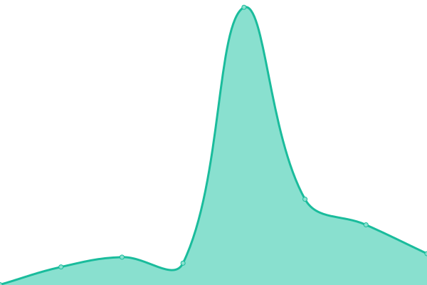

# [📈 Live Status](https://EndlessMedia-Cluster.github.io/status): <!--live status--> **🟧 Partial outage**

This repository contains the open-source uptime monitor and status page for [EndlessMedia](https://EndlessMedia-Cluster.github.io/status), powered by [Upptime](https://github.com/upptime/upptime).

With [Upptime](https://upptime.js.org), you can get your own unlimited and free uptime monitor and status page, powered entirely by a GitHub repository. We use [Issues](https://github.com/EndlessMedia-Cluster/status/issues) as incident reports, [Actions](https://github.com/EndlessMedia-Cluster/status/actions) as uptime monitors, and [Pages](https://EndlessMedia-Cluster.github.io/status) for the status page.

<!--start: status pages-->
<!-- This summary is generated by Upptime (https://github.com/upptime/upptime) -->
<!-- Do not edit this manually, your changes will be overwritten -->
<!-- prettier-ignore -->
| URL | Status | History | Response Time | Uptime |
| --- | ------ | ------- | ------------- | ------ |
|  [Comet Stremio Addon](https://comet.endlessmedia.me) | 🟥 Down | [comet-stremio-addon.yml](https://github.com/EndlessMedia-Cluster/status/commits/HEAD/history/comet-stremio-addon.yml) | 

 419ms
     
 | 

<a href="https://status.endlessmedia.me/history/comet-stremio-addon">85.89%</a>
    

|  [Knightcrawler Stremio Addon](https://knightcrawler.elfhosted.com/stream/movie/tt0023694.json) | 🟩 Up | [knightcrawler-stremio-addon.yml](https://github.com/EndlessMedia-Cluster/status/commits/HEAD/history/knightcrawler-stremio-addon.yml) | 

 522ms
     
 | 

<a href="https://status.endlessmedia.me/history/knightcrawler-stremio-addon">100.00%</a>
    

|  [StreamThru Stremio Addons](https://streamthru.endlessmedia.me) | 🟥 Down | [stream-thru-stremio-addons.yml](https://github.com/EndlessMedia-Cluster/status/commits/HEAD/history/stream-thru-stremio-addons.yml) | 

 0ms
     
 | 

<a href="https://status.endlessmedia.me/history/stream-thru-stremio-addons">0.00%</a>
    

|  TorrentIO Addon | 🟩 Up | [torrent-io-addon.yml](https://github.com/EndlessMedia-Cluster/status/commits/HEAD/history/torrent-io-addon.yml) | 

 245ms
     
 | 

<a href="https://status.endlessmedia.me/history/torrent-io-addon">100.00%</a>
    

|  [Zilean](https://zilean.endlessmedia.me/healthchecks/ping) | 🟥 Down | [zilean.yml](https://github.com/EndlessMedia-Cluster/status/commits/HEAD/history/zilean.yml) | 

 832ms
     
 | 

<a href="https://status.endlessmedia.me/history/zilean">86.87%</a>
    

<!--end: status pages-->

[**Visit our status website →**](https://EndlessMedia-Cluster.github.io/status)

## 📄 License

- Powered by: [Upptime](https://github.com/upptime/upptime)
- Code: [MIT](./LICENSE) © [Anand Chowdhary](https://anandchowdhary.com), supported by [Pabio](https://pabio.com)
- Data in the `./history` directory: [Open Database License](https://opendatacommons.org/licenses/odbl/1-0/)
